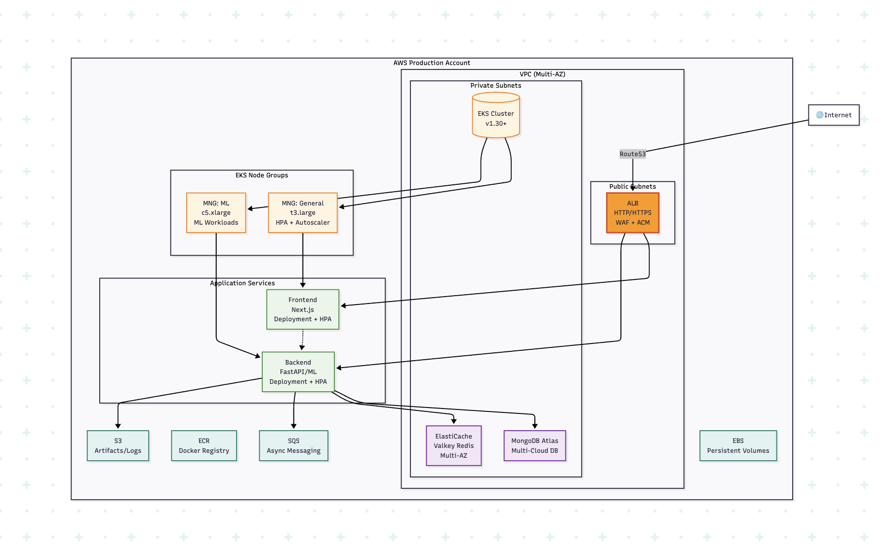

## Service Design and Architecture Design

### 1. Service Analysis & Infrastructure Selection

**Compute: EKS**

When compared to other options like Lambda, ECS Fargate, ECS EC2, App Runner, EKS has the below advantages which makes it a better choice.

1. With EKS, we will be able to deploy both frontend and backend in same ecosystem.
2. Multi workload management is efficient. As we can have multiple MNG for different workloads.
3. EKS supports helm charts, its easy to manage the deployments be it upgrade and rollback.
4. Inbuild kubernetes object HPA helps to scale at horizontally at pod level.
5. ALB controller helps to manage load balancing the traffic.
6. EKS comes with supporting multiple add-ons from AWS which helps to automate and reduce manaul operation works.

**Database: MongoDB Atlas**

When compared to other options like RDS, DynamoDB, MongoDB Atlas has the below advantages which makes it a better choice.

1. No Operational maintanence, and supports HA by using multi AZ.
2. Easy to scale vertically based on load, Single click backup and automatic backup supported.
3. Pricing based on usage.

**Caching: AWS ElastiCache with Valkey**

When compared to other options like self-managed Redis/Memcached, AWS ElastiCache with valkey has the below advantages which makes it a better choice.

1. AWS Fully managed with Multi-threaded I/O, which helps to integrate applications in EKS with IRSA.
2. Zero downtime maintanence and Multi AZ deployments to acheive upto 99.99% availability.
3. ElastiCache provides leading security (Amazon VPC, AWS IAM) and compliance standards (HIPAA eligible, FedRAMP authorized, and PCI DSS).
4. Instant scaling to match any application demand and Microsecond Latency.
5. Cost effective considering the reduction in operational work and Valkey being open source.

**Messaging: Amazon SQS**

When compared to other options like SNS, EventBridge, Amazon SQS has the below advantages which makes it a better choice.

1. Easy to decouple and scale microservices, distributed systems, and serverless applications which makes it a better choice.
2. It can process each buffered request independently and scaling transparently without zero infrastructure scaling effort.
3. Very low cost even at high scale.

**Storage: S3 and EBS**

When compared to other options like EFS, the combination of S3 and EBS has the below advantages which makes it a better choice.

1. S3 will be used as primary storage, as it supports python, FastAPI and ML libraries.
2. Highly available and durable.
3. Extremely cost effective at scale.
4. Easy integration with EKS using IRSA.
5. Zero scaling effort.
6. EBS will be the seconday storage, used as persistent storage in EKS.
7. Scaling of EBS is orchestrated by EKS.
8. Controlled and predictable cost depedning on usage.
    
## Architecture Diagram

 

    
